## 成都
### 郫都区  10公里内
#### 今年计划
- 中小学英语老师   
- 7个
- 
#### 往年分数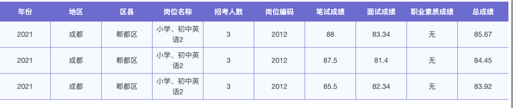
### 崇州区 
- 小学英语老师
- 2个
- 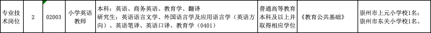
- ps： 上元小学 50km  
- ps： 东关小学 57公里
- 车程50分钟
- 往年分数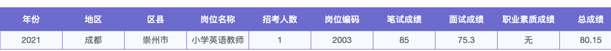
### 大邑县
- 初中英语老师
- 2个
- 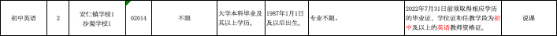
- ps：安仁镇学校  60km
- ps：沙渠学校 51km
- 往年分数 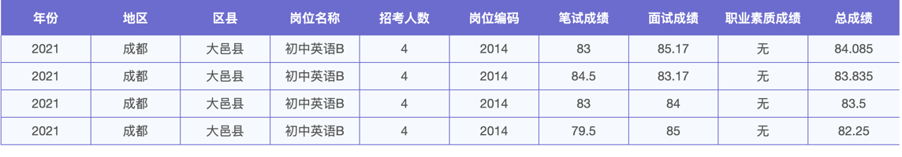
### 新都区
- 初中英语
- 2个
- 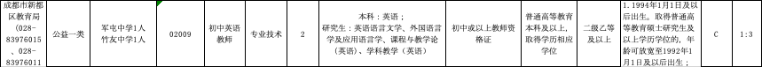
- ps：军屯中学 29km 
- ps： 竹友中学 17km
- 往年分数  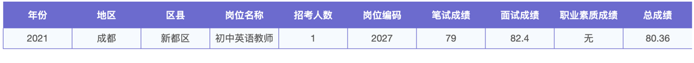
- 去年 只要的应届  
### 龙泉驿区  （经开区）
- 小学、初中英语
- 初中1 小学2
- 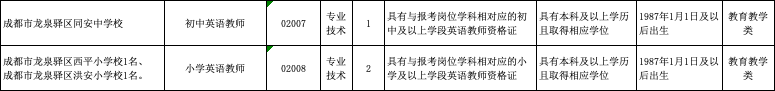
- 同安中学 48km
- 西平小学 46km
- 洪安小学 44km
- 往年分数 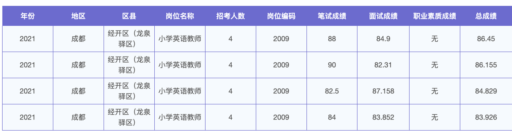
### 新津县 
- 初中英语
- 1个
- 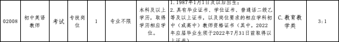
- 55km
- 去年分数 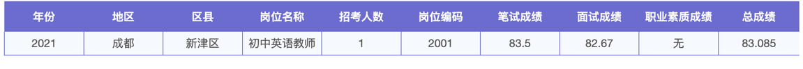
### 双流区
- 小学英语
- 2个
- 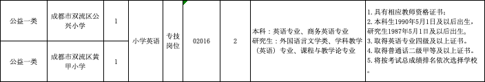
- 需要 普通话二甲
- 公兴小学 48km
- 黄甲小学 44km
- 去年不招
### 青白江区
- 初中英语
- 1个
- 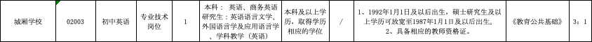
- 城厢学校 49km
- 去年分数 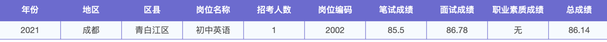